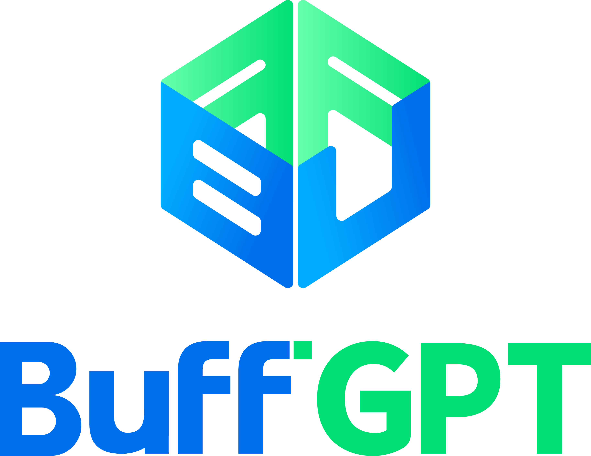
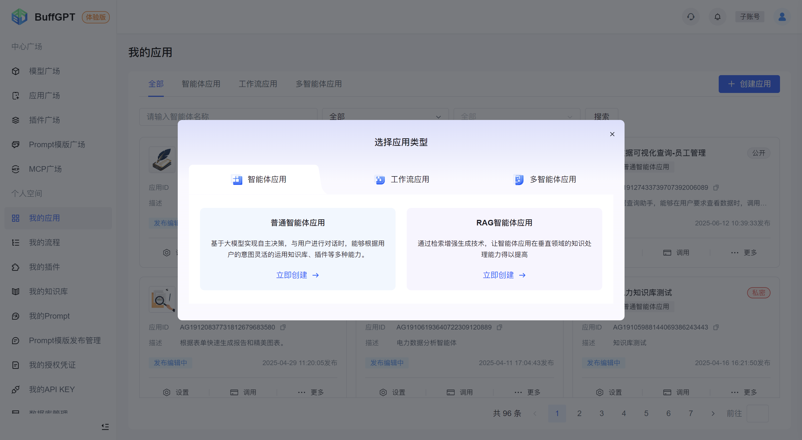
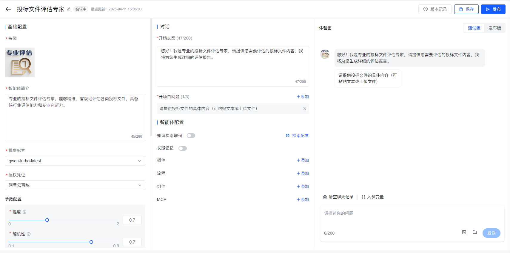
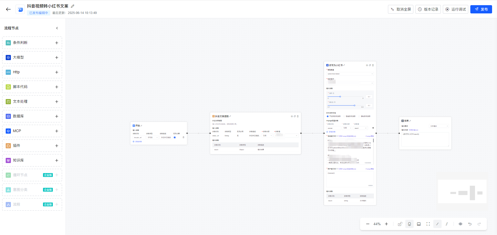
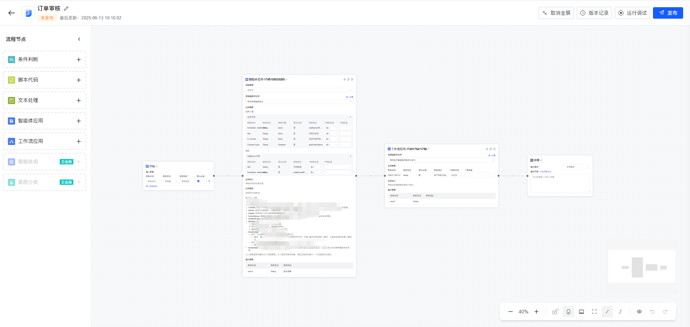
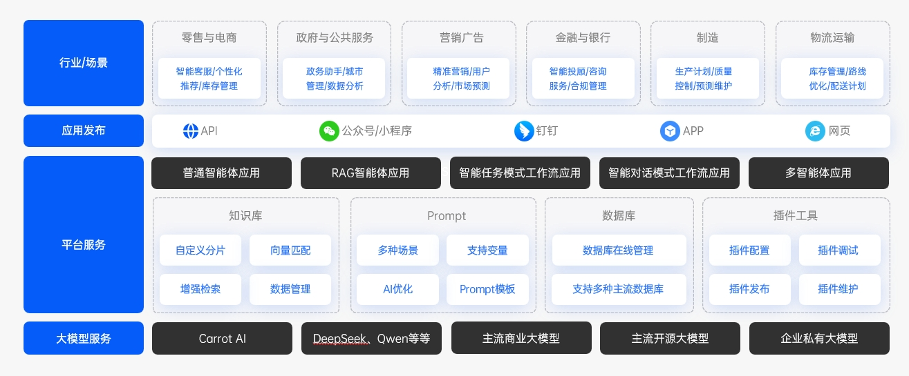

#

<b>📘 目录</b>

- 💡 [BuffGPT 是什么？](#-BuffGPT-是什么)
- 🎮 [Demo](#-demo)
- 🔥 [近期更新](#-近期更新)
- 👉 [主要功能](#-主要功能)
- ✒️ [系统架构](#-系统架构)
- 🏃 [快速开始](#-快速开始)
- 🚀 [部署服务](#-部署服务)
- 🙌 [加入社区](#-加入社区)

## 💡 BuffGPT 是什么？

[BuffGPT](https://buffgpt.agentsyun.com/) 是一个综合性AI应用开发与运营平台，旨在帮助企业和个人用户快速构建、部署和管理各类AI智能体应用。作为一站式智能体应用开发平台，BuffGPT突破了传统AI应用开发的技术门槛，通过可视化界面和模块化组件，让用户无需深厚的编程技能即可创建功能强大的AI应用。

BuffGPT平台具有以下核心特点：

• **多样化应用构建**：支持构建普通智能体应用、RAG智能体应用、工作流应用（对话型/任务型）以及多智能体应用，满足不同场景需求。

• **丰富的组件生态**：集成了知识库、插件工具、Prompt模板等多种组件，用户可以根据业务需求灵活组合，快速实现智能体功能扩展。

• **模型兼容性**：平台适配多种大模型，包括自研大模型CattotAI、第三方开源大模型以及第三方商业大模型，用户可根据实际需求选择合适的模型。

• **协作与共享机制**：通过中心广场提供模型、Prompt模板、插件和应用分享，促进资源共享与协作，加速应用创新。

• **企业级管理能力**：提供完善的部门、角色与用户管理功能，满足企业级应用的安全与权限需求。

BuffGPT平台通过简化AI应用的开发流程，使得企业可以专注于业务场景设计，加速AI技术在各行业的落地应用。无论是智能客服、HR管理、供应链优化还是生产质检等场景，BuffGPT都能提供相应的解决方案，助力企业实现数字化转型。

在当今智能化快速发展的时代，BuffGPT作为连接人工智能技术与实际业务应用的桥梁，为用户提供了从构思到实现、从开发到运营的全流程支持，使AI应用开发变得更加高效、便捷和灵活。

## 🎮 Demo 试用

请登录网址 [https://buffgpt.agentsyun.com/](https://buffgpt.agentsyun.com/) 进行体验。

## 🔥 近期更新

- 2025-06-04 应用广场增加应用能力图标展示。
- 2025-05-29 增加知识图谱功能。
- 2025-05-21 MCP支持收藏功能。
- 2025-05-15 工作流应用增加MCP节点。
- 2024-04-30 MCP支持查看运行状态。
- 2024-04-27 知识库QA问答对优化。

## 👉 主要功能

### 🌟 **智能体应用**

智能体应用基于大模型实现自主决策，与用户进行自然语言交互时，能够根据用户问题灵活运用RAG、插件、长期记忆等多种能力。这种灵活性  使得智能体能够更好地理解和满足用户需求，提供更加个性化的服务。作为企业的智能助手，智能体可以处理日常任务、提供信息查询和智能推荐等服务，从而帮助企业提高工作效率和服务质量。通过不断学习和优化，智能体将在未来发挥更加重要的作用，成为企业不可或缺的一部分

### 🌟 **工作流应用**

工作流应用赋能用户，使其能够通过直观的画布界面自定义并编排业务流程。该流程的核心编排单位为原子节点，涵盖了大模型节点、知识库节点等多种高效元素。这一特性极大地促进了业务逻辑设计的灵活性与效率，使用户能够迅速地将业务构想转化为实际行动。同时，借助这一平台，用户可以轻松实现业务效果的即时验证，从而加速业务流程的优化与迭代，提升整体工作效率与业务成果。

### 🌟 **多智能体应用**

多智能体应用为用户提供了一种高效的逻辑设计方式，允许他们通过直观的画布界面自定义智能体的执行逻辑。该应用的核心编排主题是智能体，包括智能体节点、智能体组等关键元素，使得用户能够轻松实现复杂的多智能体协同作业。这一特性极大地加速了逻辑设计和业务效果验证的过程，帮助用户快速构建出高效、协同的智能体系统。

### 🌟 **知识库**

BuffGPT的知识库功能通过RAG（检索增强生成）技术，有效克服了大语言模型（LLM）的知识过时和“幻觉”等局限，为其配备了强大的外部知识源。用户可上传多种格式的文档或结构化QA对，系统利用智能分段工具（如字符、代码或Markdown分割器）将文档切分为语义连贯的片段并存储。创建智能体应用时，可灵活配置知识库检索策略（如禁用、智能或强制联网搜索）及回答范围（仅知识库或结合LLM），确保回答精准且可溯源。对于需深度语义理解和复杂关系推理的场景，知识库还支持构建知识图谱，将文档内容解析为实体关系三元组（如<周润发，扮演，李慕白>），显著提升智能体在整合多源信息、处理复杂查询时的准确性和推理能力，最终生成基于可靠外部证据且更符合事实的答案。

### 🌟 **MCP**

BuffGPT基于MCP协议的企业级AI应用架构，充分发挥云原生API网关与服务注册中心的优势，打通了AI引擎、模型管理、数据服务与传统业务的全链路。该范式不仅提升了AI应用的开发效率与部署灵活性，也为企业实现AI能力规模化落地提供了坚实基础。

### 🌟 **插件**

插件工具对智能体应用至关重要，它们通过API集成多种功能和服务，扩展智能体应用场景，提升交互体验和实用性，增强智能体的灵活性和可扩展性，为智能体应用提供更多便捷和高效的智能服务。

### 🌟 **数据库**

在智能体应用中，关系型数据库（如MySQL、PostgreSQL）的核心作用是为智能体提供结构化业务数据的精准管理和实时操作能力，使其突破纯文本生成的限制：通过存储用户信息、订单记录、权限配置等关键业务数据，智能体可直接执行SQL查询或更新操作（如实时返回订单状态、修改会议日程），确保回答基于最新事实；同时与向量数据库互补——关系库处理精确字段检索（如ID、日期），向量库处理语义检索，二者协同实现动态知识整合（例如先查关系库获取用户订单号，再检索向量库中的相关报告）；最终赋能智能体成为可安全执行事务性操作（如转账、预约）、实施细粒度权限控制并满足审计需求的业务代理。

## ✒️ 系统架构

## 🏃 快速开始

### 📝 前提条件
- 请根据服务器环境要求，准备好对应机器。
- 当前部署支持K8S集群部署，请先部署K8S基础环境，建议版本 1.18.20。
- 在部署应用服务之前，完成基础组件部署。
- 请提前准备好推理模型，本地部署或第三方商业模型都可以支持。

### 💻 建议服务器环境
| 机器类型   | 操作系统版本       | 配置要求                                                                          | 数量  | 使用说明                             |
|--------|--------------|-------------------------------------------------------------------------------|-----|----------------------------------|
| CPU服务器 | Ubuntu 22.04 | CPU >= 4 核，RAM >= 8GB，Disk >= 100GB                                           | 1 台 | 作为K8S主节点，部署Java、web前端、中间件等服务     |
| CPU服务器 | Ubuntu 22.04 | CPU >= 8 核，RAM >= 16GB，Disk >= 200GB                                          | 2 台 | 作为K8S Node节点，部署Java、web前端、中间件等服务 |
| GPU服务器 | Ubuntu 22.04 | GPU RTX 3070 (8GB) 或 RTX 4060 Ti (16GB), CPU >= 8 核，RAM >= 32GB，Disk >= 500GB | 1 台 | 作为K8S Node节点，部署Python服务          |

### 📀 基础组件
| 组件名称         | 组件类型   | 组件版本     |
|--------------|--------|----------|
| Nacos-server | 配置注册中心 | 2.4.3    |
| Postgres     | 数据库    | 15.0     |
| RabbitMQ     | 消息中间件  | 3.7-management |
| Redis        | 缓存中间件  | 8.0.2    |
| Nginx        | Web中间件 | 1.22.1   |
| minio        | 存储服务   | RELEASE.2023-03-20T20-16-18Z |
| neo4j        | 图形数据库  | 5.26.4-community |
| milvus       | 向量数据库  | v2.4.0     |

### 🚀 部署应用服务
- 预置SQL [点击这里查看预置SQL](resources/init_platform.sql)
- 详细部署步骤 [点击这里查看详细部署步骤](resources/部署实施安装指导书.pdf)

## 👥 加入社区
- Discord [点击加入Discord](https://discord.gg/paPHkqFe)
- 微信社群 [点击加入BuffGPT社区](resources/wx.png)
